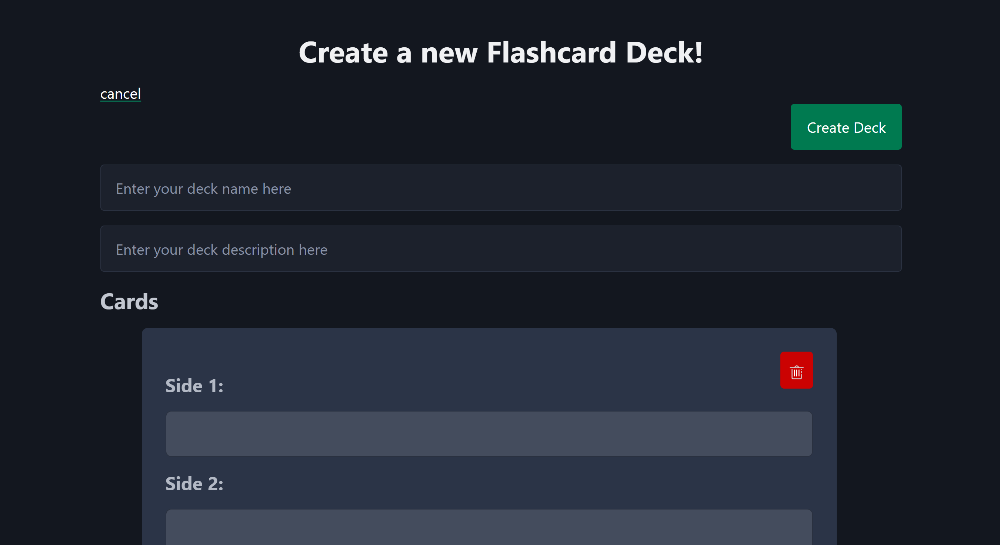
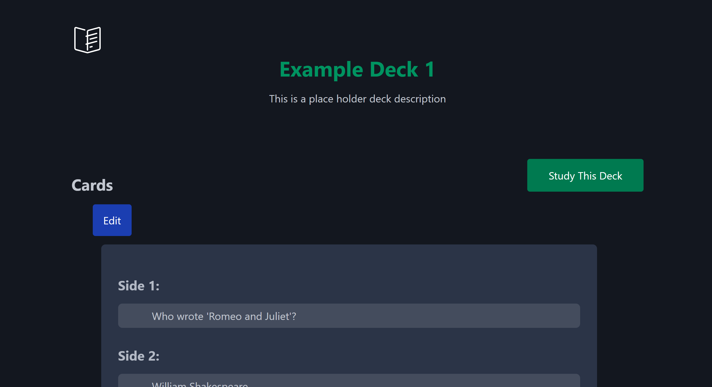
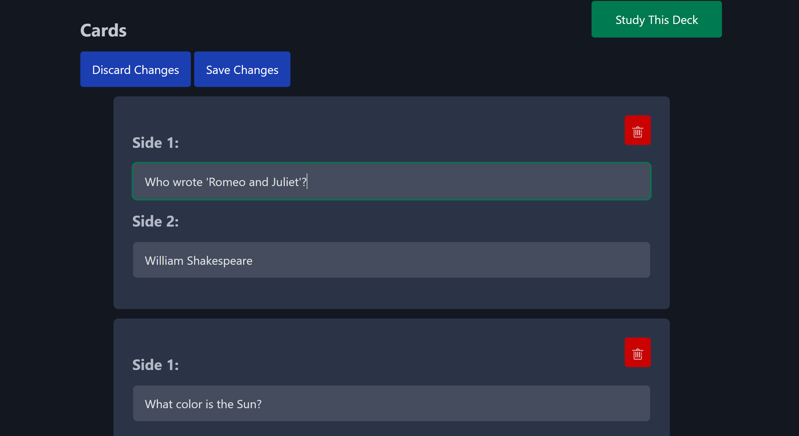
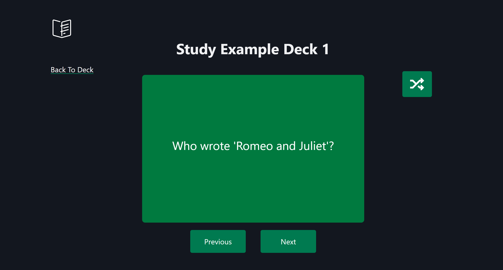

# Gage Nesbit's Flash Card App Version 1.1.0

This is ver 1.1.0 of my flash card web app, built using a variety of tools. Since my last release I've included some more features which can be found at the bottom of this document. I came up with the idea when I started learning Japanese recently and found that existing flashcard tools didn’t meet my needs. They either had too many ads or lacked useful features. This release includes solid functionality, but I believe that with more time, this app will grow into an even more robust and functional tool.

## Technologies I Used

The backend is written in Go, utilizing the Gin framework. As someone familiar with Flask in Python, I found Gin to be similar and easy to learn. I used Go's built-in HTML templating module to handle the templates, and it has worked perfectly for my needs. 

The data for my flash card decks is stored in a MySQL database. I appreciate how lightweight MySQL is and how well it suits smaller-scale projects like this. The setup was quick and straightforward. Currently, my database consists of two tables—one for decks and one for cards. As the app grows, I expect the database to evolve with additional tables and more complex relationships.

On the frontend, I used the Pico CSS library to get started, customizing it from there. I also used HTMX for several small tasks, such as dynamic content updates. Having used HTMX in the past, I found it ideal for some of the design patterns I wanted to implement. 

For the scripting, I used TypeScript to handle the functionality of flipping each flashcard and cycling through the deck. I chose TypeScript for its robust features, offering all the functionality of JavaScript with the added benefit of static typing. I plan to use TypeScript more as I expand the functionality of the study page.

## A Brief Tour of My Application

### Home Page
Here, you can navigate to the "Create a Deck" page or select which deck you want to access.

### Create A Deck Page
On this page, you can create a deck and add cards to it.

### Deck Page
On this page, you can view and edit a deck.

### Study Page
Here, you can study the flashcards in your deck. Simply click the card or hit the space bar to flip it and view the other side. You can also use the buttons or left and right arrow keys to cycle through the cards.

## The Future
This is only the first release of the project, and I plan to expand the app's functionality in the future.

Some of my plans for future features include:
1. Adding other study question styles, such as multiple choice
2. Implementing a spaced repetition algorithm for more efficient learning sessions
3. Adding the functionality for handling multiple users
4. Ability to delete deck

## Version History

### v1.1.0
- Ability to add/remove/edit cards from existing decks
- Shuffle feature
- Keyboard navigation for flashcards
- Improved UI with notiications
- General polish and stability improvements
- Refactored and commented code

### v1.0.0
- Initial release with flashcard display